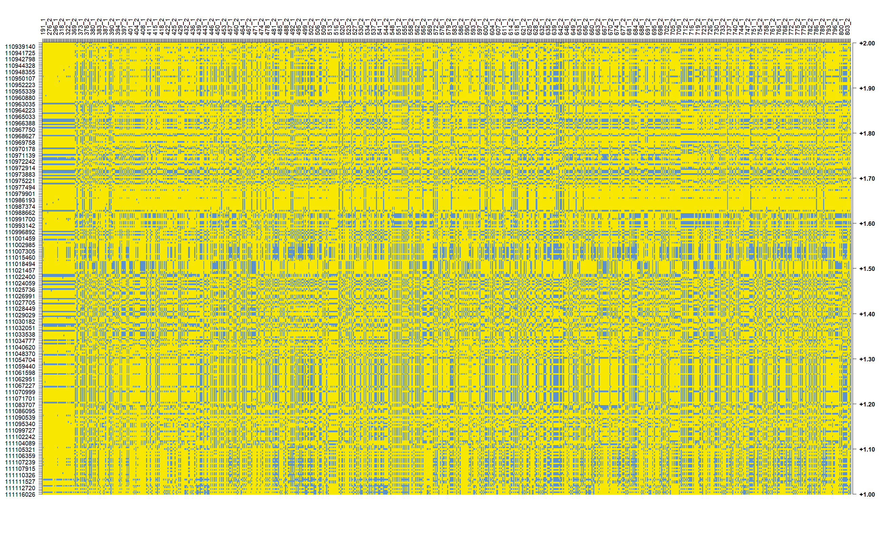

This is the second part of the code where we present the methodology and results. In this document, we apply the DIANA method to imputed the CNV genotypes of non-validated samples.

# Libraries

```{r}
#setwd("")
```


```{r}
library(readxl)
library(writexl)
library(janitor)
library(dplyr)
library(plot.matrix) ## paquete para representar matrices
library(stringr) ## ordenar columnas
#library(devtools)
library(unikn)
library(reshape)
library(doParallel)
library(caret)
library(keras)
library(pROC)
library(partykit)
#library(dplyr)
library(tidyverse)
library(cluster) # libreria para hacer clustering
library(fpc) # evaluación del clustering
library("ggplot2")
library("reshape2")
library("purrr")
library("dplyr")
# let's start with a dendrogram
library("dendextend") ## comparar y representar dendogramas
```


```{r}
colors=c("#5b91cd", "black", "#f8e701")
palette_haplotypes <- usecol(colors, n = 10)
```


Dualphase file for all samples

```{r }
phases_hmm=readRDS( "./data_and_analyses/phases_hmm.rds")
```

```{r }
phases_hmm <- phases_hmm %>%
  mutate(ID_haplotipo = as.factor(paste0(id_pedigri, "_",haplotipo)))
```


The haplotype matrices for all 454 samples

```{r}
all_samples_phases_283_factor=readRDS("./data_and_analyses/all_samples_phases_283_factor.rds")
all_samples_phases_283_numeric=readRDS("./data_and_analyses/all_samples_phases_283_numeric.rds")
```


```{r eval=FALSE, include=FALSE}
all_samples_phases_283_factor
all_samples_phases_283_numeric
```

```{r eval=FALSE, fig.height=15, fig.width=25, include=FALSE}

par(mar=c(6.1, 6.1, 6.1, 6.1))

brk <- 10

plot(as.matrix(data.frame(t(all_samples_phases_283_numeric), check.names = F)), border=NA, na.col='white', breaks=brk, col=palette_haplotypes, xlab="", ylab="", main="", las=2,
     key=list(side=4,  font=2, cex.axis=1, cex.lab=2, spacing.key=0.5), axis.col=list(side=3, las=3),
     polygon.key=NULL, axis.key=NULL, spacing.key=c(1,0.5,0.5))
#abline(v=seq(from=2.5, to=130.5, by = 2), col="gray", lwd=2.8, lty=1)

```

Haplotype matrix of all samples 

```{r fig.height=15, fig.width=25}

```

### Haplotype matrix of unambiguous SNPs for all samples

````{r}
all_samples_phases_67_factor=readRDS("./data_and_analyses/all_samples_phases_67_factor.rds")
all_samples_phases_67_numeric=readRDS("./data_and_analyses/all_samples_phases_67_numeric.rds")
```

```{r}
all_samples_phases_67_factor
all_samples_phases_67_numeric
```


```{r  fig.height=10, fig.width=20}

#output_filename <- "./data_and_analyses/imagenes/plotmatrix_800_snps_clustering.png"
#output_width <- 2000
#output_height <- 1000

par(mar=c(6.1, 6.1, 6.1, 6.1))

brk <- 10

plot(as.matrix(data.frame(t(all_samples_phases_67_numeric), check.names = F)), border=NA, na.col='white', breaks=brk, col=palette_haplotypes, xlab="", ylab="", main="", las=2,
     key=list(side=4,  font=2, cex.axis=1, cex.lab=2, spacing.key=0.5), axis.col=list(side=3, las=3),
     polygon.key=NULL, axis.key=NULL, spacing.key=c(1,0.5,0.5))
abline(v=seq(from=2.5, to=130.5, by = 2), col="gray", lwd=2.8, lty=1)

#dev.off()
```


## Clustering 67 SNPs

### DIANA method

```{r}
gower.dist_67_all_samples <- daisy(all_samples_phases_67_factor, metric = c("gower"))
```


```{r}
class(gower.dist_67_all_samples)
```

```{r fig.width=15, fig.height=15}
divisive.clust_67_all_samples <- diana(as.matrix(gower.dist_67_all_samples), 
                  diss = TRUE, keep.diss = TRUE)
plot(divisive.clust_67_all_samples, main = "Divisive")
```

```{r}
plot_matrix_67_all_divisive_order=data.frame(t(all_samples_phases_67_numeric[as.vector(divisive.clust_67_all_samples$order.lab), ]), check.names = F)
dim(plot_matrix_67_all_divisive_order)
```


**Haplotype matrix by clustering order**

```{r eval=FALSE, fig.height=10, fig.width=20, include=FALSE}

par(mar=c(6.1, 6.1, 6.1, 6.1))

brk <- 10

plot(as.matrix(plot_matrix_67_all_divisive_order[,]), border=NA, na.col='white', breaks=brk, col=palette_haplotypes, xlab="", ylab="", main="", las=2,
     key=list(side=4,  font=2, cex.axis=1, cex.lab=2, spacing.key=0.5), axis.col=list(side=3, las=3),
     polygon.key=NULL, axis.key=NULL, spacing.key=c(1,0.5,0.5))
#abline(v=seq(from=2.5, to=130.5, by = 2), col="gray", lwd=2.8, lty=1)

```
```{r}
#data.frame(t(all_samples_phases_67_numeric[as.vector(divisive.clust_67_all_samples$order.lab), ]), check.names = F)
```

```{r eval=FALSE, fig.align='center', fig.cap="**Caption**", fig.height=5, fig.width=8, include=FALSE}

dendro_d67 <- as.dendrogram(divisive.clust_67_all_samples)
dendro.col_d67 <- dendro_d67 %>%  hang.dendrogram(hang_height = .03) %>% 
  set("branches_k_color", k = 2, value =   c( "#10E028", "#A716D6")) %>%
  set("branches_lwd", 0.8) %>%
  set("labels_colors", 
      value = c("darkslategray")) %>%  
  set("labels_cex", 0.5)  %>%  rotate(as.character(divisive.clust_67_all_samples$order.lab))
ggd1_d67 <- as.ggdend(dendro.col_d67)
dend_divisiveplot67=ggplot(ggd1_d67, horiz=F, theme = theme_minimal()) +
  labs(x = "Num. observations", y = "Height", title = "DIANA dendrogram all samples, 67 unambiguous SNPs, k = 2") +
  theme(plot.title = element_text(hjust = 0.2,  size = 10), axis.title.x = element_text(size=8), axis.title.y = element_text(size=8))
```


```{r eval=FALSE, include=FALSE}
saveRDS(dend_divisiveplot67, "./data_and_analyses/dend_divisiveplot67.rds")

```

```{r fig.height=5, fig.width=15, fig.align='center'}
dend_divisiveplot67=readRDS("./data_and_analyses/dend_divisiveplot67.rds")
dend_divisiveplot67
```


```{r eval=FALSE, include=FALSE}
stats.df.divisive_67_all <- cstats.table(gower.dist_67_all_samples, divisive.clust_67_all_samples, 7)
stats.df.divisive_67_all
```

```{r eval=FALSE, include=FALSE}
saveRDS(stats.df.divisive_67_all, "./data_and_analyses/stats.df.divisive_67_all.rds")

```

```{r}
stats.df.divisive_67_all=readRDS("./data_and_analyses/stats.df.divisive_67_all.rds")
stats.df.divisive_67_all
```


```{r eval=FALSE, fig.align='center', fig.height=4, fig.width=4, include=FALSE}
# --------- Choosing the number of clusters ---------#
# Using "Elbow" and "Silhouette" methods to identify the best number of clusters
# to better picture the trend, I will go for more than 7 clusters.
library(ggplot2)
# Elbow
# Divisive clustering
elbow_plot=ggplot(data = data.frame(t(cstats.table(gower.dist_67_all_samples, divisive.clust_67_all_samples, 7))), 
  aes(x=cluster.number, y=within.cluster.ss)) + 
  geom_point()+
  geom_line()+
  ggtitle("Divisive clustering all samples 67 unambiguous SNPs") +
  labs(x = "Num.of clusters", y = "Within clusters sum of squares (SS)") +
  theme(plot.title = element_text(hjust = 0.5))
```


```{r eval=FALSE, include=FALSE}
saveRDS(elbow_plot, "./data_and_analyses/elbow_plot.rds")

```

```{r fig.height=5, fig.width=10, fig.align='center'}
elbow_plot=readRDS("./data_and_analyses/elbow_plot.rds")
elbow_plot
```


El clustering con 67 SNPs es muy claro:

## Determining which haplotypes are in each cluster:

- Cluster 1
1:647

- Cluster 2
648:908


```{r}
table_translating_genotypes_divisive_all_samples=readRDS("./data_and_analyses/table_translating_genotypes_divisive_all_samples.rds")
table_translating_genotypes_divisive_all_samples
```

```{r}
table_translating_genotypes_divisive_all_samples=arrange(table_translating_genotypes_divisive_all_samples, desc(genotype), id_pedigri) ##desc() ordena de manera descendiente
table_translating_genotypes_divisive_all_samples
```


```{r}
unique(table_translating_genotypes_divisive_all_samples$genotype)
```

```{r}
table(table_translating_genotypes_divisive_all_samples$genotype)
sum(table(table_translating_genotypes_divisive_all_samples$genotype))
```


```{r eval=FALSE, include=FALSE}
write_xlsx(table_translating_genotypes_divisive_all_samples, "./data_and_analyses/genotypes_cnv_clustering_454_ind.xlsx")
```

```{r}
genotypes_all_ind= read_excel("./data_and_analyses/genotypes_cnv_clustering_454_ind.xlsx")
genotypes_all_ind$id_pedigri=as.factor(genotypes_all_ind$id_pedigri)
legend_ids=read_excel("./data_and_analyses/legend_ID.xlsx")
legend_ids
```

```{r }
legend_ids=janitor::clean_names(legend_ids)
legend_ids$id_pedigri=as.factor(legend_ids$id_pedigri)
legend_ids
```

## Validation via qPCR of the CNV status of 9 individuals with imputed CNV genotypes.


```{r}
validation_imputed_samples=read_excel("./data_and_analyses/RQ_validation_cnv.xlsx")


a=left_join(validation_imputed_samples, legend_ids)


 
validation_imputed_samples=left_join(a, genotypes_all_ind, by="id_pedigri")

#write_xlsx(validation_imputed_samples, "./data_and_analyses/validation_imputed_samples.xlsx")
validation_imputed_samples
```
Rq*2 greater than 2.5 can be considered DUP (HT or C/C). We see that only results from sample 294 do not match. 


